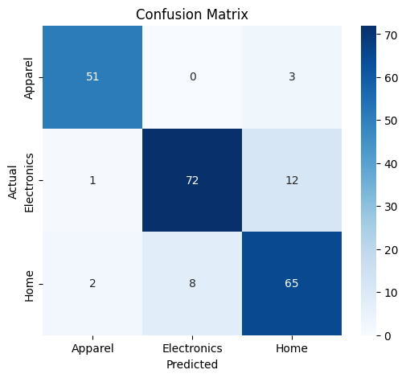

# Product-Image Classifier (CNN)

I built this project to simulate a real catalogue-automation task: sorting e-commerce product photos into **Apparel**, **Electronics**, and **Home** categories. The use case is inspired by the kind of work a Flipkart-style catalogue team might do.

My goal was to train a CNN, push validation accuracy past 85%, and produce a confusion-matrix breakdown that explains exactly where and why the model fails.

## Dataset

I used the `ecommerce_product_images_18K` dataset from Kaggle. I filtered the original 9 marketplace categories down to 3:

| Original category | Class used here |
|---|---|
| `CLOTHING_ACCESSORIES_JEWELLERY` | Apparel |
| `ELECTRONICS` | Electronics |
| `HOME_KITCHEN_TOOLS` | Home |

That left me with 1,074 images:

| Class | Images |
|---|---:|
| Apparel | 278 |
| Electronics | 351 |
| Home | 445 |

I split the images 80/20 into training and validation using a fixed random seed. That gives me about 860 training images and 214 validation images.

## Approach: Two Models, Built and Compared

### 1. Baseline CNN

I started with a small custom CNN trained from scratch. It has 3 Conv2D + MaxPooling blocks with 32, 64, and 128 filters, followed by a dense head with dropout. I trained it with EarlyStopping using `patience=3` and monitoring validation accuracy.

Training stopped early at epoch 6 of 20. The result was roughly 53% validation accuracy, well short of the 85% target. That result makes sense here: about 860 training images is not enough for a CNN to learn all of its visual features completely from scratch.

### 2. Final model: MobileNetV2 transfer learning

For the final model, I used MobileNetV2 pretrained on ImageNet, which contains 1.4 million images, as a frozen base. I trained only a small classification head on top:

`GlobalAveragePooling2D` + `Dropout(0.3)` + a dense softmax layer

Only 3,843 parameters were actually trained, compared with 2,257,984 parameters frozen inside the pretrained base. This is the standard fix when a from-scratch CNN underperforms on a small dataset.

**Result: 87.85% validation accuracy**, which clears the 85% target.

## Per-Class Results

These results come from the classification report on the 214-image validation set.

| Class | Precision | Recall | F1-score | Support |
|---|---:|---:|---:|---:|
| Apparel | 0.94 | 0.94 | 0.94 | 54 |
| Electronics | 0.90 | 0.85 | 0.87 | 85 |
| Home | 0.81 | 0.87 | 0.84 | 75 |

Overall accuracy is **0.88**. The macro average is **0.89**, and the weighted average is **0.88**.

## Confusion Matrix

The raw confusion counts are:

- Apparel was correctly predicted 51/54 times. The other 3 were mistaken for Home.
- Electronics was correctly predicted 72/85 times. Of the mistakes, 12 were predicted as Home and 1 as Apparel.
- Home was correctly predicted 65/75 times. Of the mistakes, 8 were predicted as Electronics and 2 as Apparel.

The most confused pairs were Electronics -> Home (12 images), Home -> Electronics (8 images), Apparel -> Home (3 images), Home -> Apparel (2 images), and Electronics -> Apparel (1 image).

Electronics and Home together account for 20 of the 26 total errors, or 77%. Apparel is rarely confused with either of the other classes.

## Why It Fails Where It Fails

This is how I interpret the errors rather than treating the confusion matrix as just a score:

1. Small accessories with no distinctive visual signature, such as a phone case, get misclassified. There may be no screen, wires, or buttons for the model to use, so the image looks like a generic object instead of something that is clearly electronic.
2. Some electronics are camouflaged by their shape. A device shaped like a toy or a piece of decor, such as a novelty-shaped Bluetooth speaker, can visually read as a Home item even though it is functionally Electronics.
3. There is genuine ambiguity at the category boundary. Small kitchen appliances like mixers and kettles are Home because they are used in a kitchen, but they are also Electronics because they have a motor or a plug. That overlap is in the category definitions themselves, not just a weakness in the model.
4. There is also a data-quality issue. At least one source image, a candy product, was mislabeled as Electronics in the original dataset. That means the achievable accuracy ceiling is somewhat below 100% regardless of how good the model is.

## Recommendation

I would route Electronics/Home predictions with low model confidence to manual review by the catalogue team. Apparel predictions need only minimal spot-checking, since that class is rarely confused with anything else.

## How to Run This Yourself

The full workflow is in [notebooks/01_train_classifier.ipynb](notebooks/01_train_classifier.ipynb). The dataset setup and download details are in [data/README.md](data/README.md).

To reproduce the work:

1. Open the notebook in Google Colab.
2. Set the runtime to a GPU, using the free T4 GPU if it is available.
3. Follow `data/README.md` to prepare the dataset.
4. Run the notebook cells from top to bottom.

## What I'd Try Next

- Unfreeze some MobileNetV2 layers and fine-tune them carefully after training the classification head.
- Collect more Electronics and Home images specifically around the confused boundary.
- Manually re-check the source images for mislabeled examples, including the candy product.

## Tech Stack

TensorFlow/Keras, MobileNetV2 transfer learning, Google Colab free T4 GPU, scikit-learn for the confusion matrix and classification report, and matplotlib and seaborn for visualizations.
